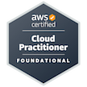

## Hey there! 👋  

***"I’m Romain, a 21-year-old student at 19 (part of the 42 Network). I’m into tech and set on making cybersecurity my thing—looking to build skills and tackle real challenges."***     
  

---

 

  

---

 

 

---

### 🚀 **Technologies & Tools**

  

---

### 🏅 **Cloud Certifications**

 
  
   |  |
  

---

### 🔥 **Want to learn:**

  

---
